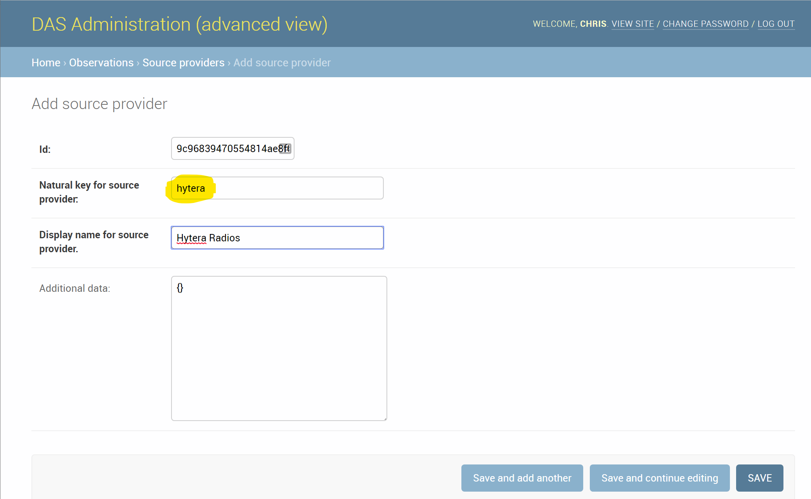

.. _sensors:

Sensors
===========================

GPS Radio API
-----------------------------

The GPS Radio API, also known as the Generic API, is the preferred method for posting track data. The pieces of information submitted identify the radio
to the system. To do this we need a unique name for the radio, which appears in the UI. Also, we can specify the person/animal type being tracked by this radio. The radio type, whether its a vehicle tracking or ranger radio. The unique device id, preferably the device serial number or unique number coming from TRBOnet.
Any additional data to be stored with the observation. For example some collars record the ambient temperature which we do not have a discrete field to store this value.

* A unique name for the device (which appears in the UI to identify the tracked asset).
* The radio type, to indicate whether it is a `gps-radio` or other `tracking-device`.
* A unique device ID, preferably a serial number or other unique external identifier.
* Note on ISO dates. When submitting an ISO date, be sure to include a timezone marker, even if it's just "Z" for UTC. Otherwise, without the timezone setting, the ER server assumes the timezone is the configured ER Server timezone. This is typically the timezone of the site.

Provider_key
^^^^^^^^^^^^^^^^^^^^^^^^^^^
A provider_key is included in the POST url. This is authored with DAS's administration UI in the "Source Providers" area. It the provider does not previously exist in ER, it will be created automatically when posting status.

   Example of adding a Source provider in the Django admin. Here we are adding a Hytera radio source provider.

Status API
^^^^^^^^^^^^^^^^^^^^^^^^^^^^

.. http:post:: /sensors/gps-radio/(string:provider_key)/status

    Post lat/lon positional data from a GPS tracking device.
    Include the unique device id in the data.

    :param provider_key: this maps to the provider name

   :reqheader Authorization: Bearer <auth token>
   :reqheader Accept: application/json

   :reqjson string subject_name: the name that appears in DAS for this sensor. default is the manufacturer_id
   :reqjson string subject_subtype: the default is 'ranger', subtypes are defined in your site's administrative pages at this path: /admin/observations/subjectsubtype/
   :reqjson string source_type: the default is the provider_key, possible values are [tracking-device, trap, seismic, firms, gps-radio]
   :reqjson string model_name: the default is to concatenate "sensor_type:provider_key"
   :reqjson string recorded_at: iso time at gps location
   :reqjson string manufacturer_id: serial number or other unique sensor value
   :reqjson obj additional: json key value pairs of unstructured information stored with observation

   **Example Sensor Post**:

   .. code-block:: json

        {
            "location": {"lat": 31, "lon": 2},
            "recorded_at": "2019-01-04T16:18:44.056439",
            "manufacturer_id": "radio_sn_1",
            "subject_name": "Ranger Alpha",
            "subject_subtype": "ranger",
            "model_name": "Radio Model 1",
            "source_type": "gps-radio",
            "additional": {"gps_error": ".05"}
        }

   **Example request with multiple observations**

   You can post an array of observations as show below. *The structure of each observation is the same as above.* Using this method we suggest sending as many as 100 observations per request.

   .. code-block:: json

        [
            {
                "location": {"lat": 37, "lon": -2},
                "recorded_at": "2019-05-17T06:41:32.439023",
                "manufacturer_id": "radio_sn_1",
                "subject_name": "Ranger Alpha",
                "subject_subtype": "ranger",
                "model_name": "Radio Model 1",
                "source_type": "tracking-device",
                "additional": {"gps_error": ".21"}
            },
            {
                "location": {"lat": 36, "lon": -3},
                "recorded_at": "2019-05-17T06:41:32.910902",
                "manufacturer_id": "radio_sn_2",
                "subject_name": "Ranger Beta",
                "subject_subtype": "ranger",
                "model_name": "Radio Model 1",
                "source_type": "tracking-device",
                "additional": {"temperature": 19, "gps_error": ".16"}
            }
        ]

   :param provider_key: this maps to the provider name

   :reqheader Authorization: Bearer <auth token>
   :reqheader Accept: application/json

   :reqjson string subject_name: the name that appears in DAS for this sensor. default is the manufacturer_id
   :reqjson string subject_subtype: the default is 'ranger', subtypes are defined in your site's administrative pages at this path: /admin/observations/subjectsubtype/
   :reqjson string source_type: the default is the provider_key, possible values are [tracking-device, trap, seismic, firms, gps-radio]
   :reqjson string model_name: the default is to concatenate "sensor_type:provider_key"
   :reqjson string recorded_at: iso time at gps location
   :reqjson string manufacturer_id: serial number or other unique sensor value
   :reqjson string subject_name: the name that appears in DAS for this sensor. default is the manufacturer_id
   :reqjson obj additional: json key value pairs of unstructured information stored with observation

DAS Radio Agent API
---------------------------
Similar to the gps-radio API, this interface supports the unique attributes of a more sophisticated handheld radio system software.
This includes GPS recording and general radio status.

.. http:post:: /sensors/dasradioagent/(string:provider_key)/status

   The dasradioagent api supports the gps-radio json parameters discussed earlier, plus the ability to send overall integration and base station status.
   We do this by adding a "message_key" field that defines the status message type. Two types of status messages are then supported. The first "observation" is our augmented observation message we have
   been using previously. The second is the "heartbeat" message to inform us of the general radio system status, with a completely new set of parameters.

   :reqjson string message_key: if "observation", this is our augmented observation message, otherwise if it's a "heartbeat" message there are a different set of data fields submitted see below. [observation, heartbeat]

Observation message_key
^^^^^^^^^^^^^^^^^^^^^^^^^^^
The standard observation fields found in the GPS Radio API apply. Additionally, we add a few fields to the "additional" key to describe the state of the handheld or basestation radio.
The following are fields found in the "additional" obj field for an 'observation' message:

.. http:post:: /sensors/dasradioagent/(string:provider_key)/status

   :reqjson string event_action: default is unknown. This is a hint to desccribe the reason for the status, whether it was a location change or if it was a radio state change [unknown, device_location_changed, device_state_changed]
   :reqjson string radio_state: default is offline. [offline, online-gps, online, alarm]. This translates to the following radio icon colors displayed in DAS: offline:Gray, online-gps:Green, online:Blue, alarm:Red.
   :reqjson string radio_state_at: iso date of radio state change time
   :reqjson string last_voice_call_start_at: iso date of last mic key, the last time the user initiated a voice call.
   :reqjson string location_requested_at: iso date of when the last time the location was requested. This is a TRBOnet specific feature, where we proactively request the location of the device when we observe the radio's mic key has been pressed.

   **Example Sensor Post**:

   .. code-block:: json

        {
            "message_key": "observation",
            "location": {"lat": 31, "lon": 2},
            "recorded_at": "2019-01-04T16:18:44.056439Z",
            "manufacturer_id": "radio_sn_1",
            "subject_name": "Ranger Alpha",
            "subject_subtype": "ranger",
            "model_name": "Radio Model 1",
            "source_type": "gps-radio",
            "additional": {"gps_error": ".05", "event_action": "device_state_changed", "radio_state": "online-gps", "radio_state_at": "2019-01-04T16:18:44.056439Z"}
        }

Heartbeat message_key
^^^^^^^^^^^^^^^^^^^^^^^^^^^
   When we set the message_key to "heartbeat", we are posting system status information.

.. http:post:: /sensors/dasradioagent/(string:provider_key)/status

   To post a heartbeat, include the following attributes:

   :reqjson string message_key: "heartbeat"
   :reqjson dict heartbeat: {}
   :reqjson dict datasource: {}

   Each of "heartbeat" and "datasource" contain a dictionary that is best described with an example (shown below).

   Within "heartbeat", include these:

   :reqjson string title: "System Activity" <-- This will display in EarthRanger's status list.
   :reqjson int interval: This indicates the expected heartbeat interval. This is in seconds. Standard is 15 seconds.
   :reqjson string latest_at: Current time in ISO format (see example below)
   :reqjson string started_at: The time your process last started. The time the integrations started.
   :reqjson string uptime: optional A description indicating how long the service has been running. An example "6 days"

   Within "datasource", include these:

   :reqjson string title: A string to indicate the activity that the system is providing. An example: "Radio Activity"
   :reqjson boolean connected: Indicate whether the datasource is connected. [true, false]
   :reqjson string connection_changed_at: An ISO datetime to indicate that last time the connection state changed. When the integration successfully connected to the radio base station. For example if the base station restarted, this would update upon successful re-connection to the basestation.
   :reqjson string latest_at: An ISO datetime to indicate the latest time of data activity. For example: radio location or state change

   .. code-block:: json

            {
                "message_key": "heartbeat",

                "heartbeat": {
                    "title": "System Activity",
                    "interval": 15,
                    "latest_at": "2019-03-21T15:34:01+00:00",
                    "started_at": "2019-03-15T10:21:48+00:00",
                    "uptime": "6 days 05:12:13"
                },
                "datasource": {
                    "title": "Radio Activity",
                    "connected": true,
                    "connection_changed_at": "2019-03-20T15:34:01+00:00",
                    "latest_at": "2019-03-21T12:21:28+00:00"
                }
            }

   :reqheader Authorization: Bearer <auth token>
   :reqheader Accept: application/json
   :statuscode 201: observation successfully posted
   :statuscode 200: heartbeat successfully posted

Camera Trap API
-----------------------------

.. http:post:: /sensors/camera-trap/<provider>/status

   Post a new camera trap image. Suggest making the imagename unique by including
   the camera name in the image name.

    There are two ways to submit location, time of capture, camera name, etc. The
    first is by posting additional json formatted data with the 'filecontent.file'
    field. A second way is to embed this data in the exif of the image. If both sources
    of data are submitted, the direct fields override the same data found in the images
    exif.

    Additional Fields:
    | "location": {"latitude": 36.02339, "longitude": 192.38282}
    | "camera_name": "<camera name here>"
    | "time": "<iso formatted time with timezone>"
    | "camera_description": "<description here>"
    | "camera_version": "<camera version>"

    Exif:
      | DateTimeOriginal -> report time
      | OffsetTimeOriginal -> if found is used to set the timezone offset for DateTimeOriginal
      | GPSLatitude, GPSLongitude -> parsed and used to set the location of the report

    Specific <provider> support:

    if provider is generic
      | "camera_name" or Model -> cameratraprep_camera-name
      | "camera_description" or Make -> cameratraprep_camera-make
      | "camera_version" or Software -> cameratraprep_camera-version

   :reqheader Authorization: Bearer <auth token>
   :reqheader Accept: application/json
   :reqheader Content-Type: multipart/form-data

   :form filecontent.file: <image> <filename>

   :statuscode 201: image successfully posted
   :statuscode 409: camera trap image has already been posted, this one ignored

   **Example request**:

   .. sourcecode:: http

      POST /sensors/camera-trap/generic/status HTTP/1.1
      Host: das-server
      Content-Type: application/octet-stream
      Accept: application/json

      filecontent.file

   **Example request**:

   .. sourcecode:: python

        import requests
        DAS_API_ROOT = 'https://<server>.pamdas.org/api/v1.0'
        DAS_TOKEN = '<oauth token here>'

        image_file = '2017-11-08.jpg'
        data = {'location': json.dumps({'latitude': 0,
                         'longitude': 0}),
               }
        content_type = 'application/jpeg'

        url = '{0}/sensors/camera-trap/generic/status'.format(DAS_API_ROOT)
        headers = {'Authorization': 'Bearer {token}'.format(token=DAS_TOKEN)}
        with open(image_file, 'rb') as fh:
            files = {'filecontent.file': (unique_image_name, fh,
                     content_type)}
            result = requests.post(url, headers=headers, files=files, data=data)

        if result.status_code != requests.codes.created:
            result.raise_for_status()