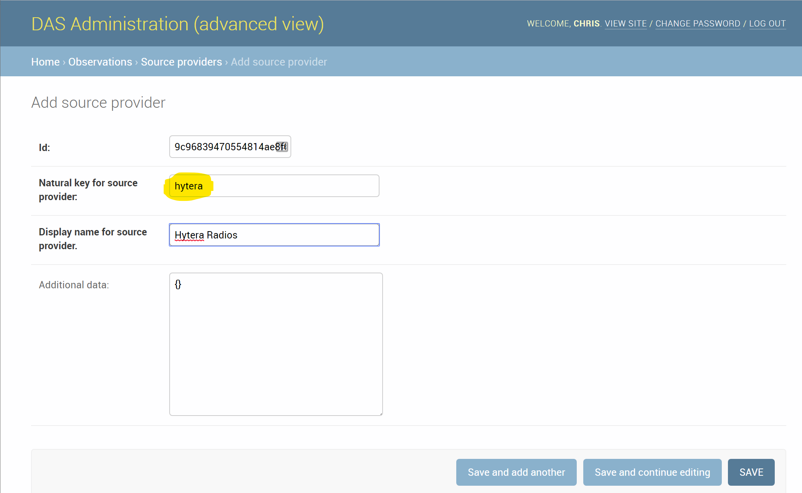

.. _sensors:

Sensors
===========================

GPS Radio API
-----------------------------

The GPS Radio API is the preferred method for posting track data. The pieces of information submitted identify the radio
to the system. To do this need the unique name for the radio, which appears in the UI. The person/animal type being tracked by this radio for instance
if its an elephant. The radio type, whether its a vehicle tracking or ranger radio. The unique device id, preferably the device serial number or unique number coming from TRBOnet.
Any additional data to be stored with the observation. For example some collars record the ambient temperature which we do not have a discrete field to store this value.

Provider_key
^^^^^^^^^^^^^^^^^^^^^^^^^^^
In the URL of the api, is referenced a provider_key. This is authored in the "Source providers" table prior to posting to the API.

   Example of adding a Source provider in the Django admin. Here we are adding a Hytera radio source provider.

.. http:post:: /sensors/gps-radio/(string:provider_key)/status

    Post lat/lon positional data from a GPS tracking device. This is a generic API for posting positional data.
    Include the unique device id in the data.

    :param provider_key: this maps to the provider name

   :reqheader Authorization: Bearer <auth token>
   :reqheader Accept: application/json

   :reqjson string subject_name: the name that appears in DAS for this sensor. default is the manufacturer_id
   :reqjson string subject_subtype: the default is 'ranger', subtypes are defined in your site's administrative pages at this path: /admin/observations/subjectsubtype/
   :reqjson string source_type: the default is the provider_key, possible values are [tracking-device, trap, seismic, firms, gps-radio]
   :reqjson string model_name: the default is to concatenate "sensor_type:provider_key"
   :reqjson string recorded_at: iso time at gps location
   :reqjson string manufacturer_id: serial number or other unique sensor value
   :reqjson obj additional: json key value pairs of unstructured information stored with observation

   **Example Sensor Post**:

   .. code-block:: json

        {
            "location": {"lat": 31, "lon": 2},
            "recorded_at": "2019-01-04T16:18:44.056439",
            "manufacturer_id": "radio_sn_1",
            "subject_name": "Ranger Alpha",
            "subject_subtype": "ranger",
            "model_name": "Hytera PD782",
            "source_type": "",
            "additional": {"gps_error": ".05"}
        }

DAS Radio Agent API
^^^^^^^^^^^^^^^^^^^^^^^^^^^
.. http:post:: /sensors/dasradioagent/(string:provider_key)/status

   Similar to the gps-radio API, this interface supports the unique attributes of the TRBOnet radio software.
   This includes GPS recording and general radio status.

   This api supports the gps-radio json parameters plus:

   :reqjson string message_key: if heartbeat, this is a heartbeat message describing the sensor handlers operational status default is observation. For instance is the TRBOnet server running. [observation, heartbeat]

   The following are fields found in the "additional" obj field for an 'observation' message:

   :reqjson string event_action: default is unknown. [unknown, device_location_changed, device_state_changed]
   :reqjson string radio_state: default is offline. [offline, online-gps, online, alarm]. This translates to the following radio icon colors displayed in DAS: offline:Gray, online-gps:Green, online:Blue, alarm:Red.
   :reqjson string radio_state_at: iso date of radio state change time
   :reqjson string last_voice_call_start_at: iso date of last mic key, the last time the user initiated a voice call.
   :reqjson string location_requested_at: iso date of...

   This API also allows posting system status information as a "heartbeat".

   To post a heartbeat, include the following attributes:

   :reqjson string message_key: "heartbeat"
   :reqjson dict heartbeat: {}
   :reqjson dict datasource: {}

   Each of "heartbeat" and "datasource" contain a dictionary that is best described with an example (shown below).

   Within "heartbeat", include these:

   :reqjson string title: "System Activity" <-- This will display in EarthRanger's status list.
   :reqjson int interval: This indicates the expected heartbeat interval.
   :reqjson string latest_at: Current time in ISO format (see example below)
   :reqjson string started_at: The time your process last started
   :reqjson string uptime: optional A description indicating how long the service has been running.

   Within "datasource", include these:

   :reqjson string title: A string to indicate the the activity that the system is providing
   :reqjson boolean connected: Indicate whether the datasource is connected
   :reqjson string connection_changed_at: An ISO datetime to indicate that last time the connection state changed
   :reqjson string latest_at: An ISO datetime to indicate the latest time of data activity.

   .. code-block:: json

            {
                "message_key": "heartbeat",

                "heartbeat": {
                    "title": "System Activity",
                    "interval": 15,
                    "latest_at": "2019-03-21T15:34:01+00:00",
                    "started_at": "2019-03-15T10:21:48+00:00",
                    "uptime": "6 days 05:12:13"
                },
                "datasource": {
                    "title": "Radio Activity",
                    "connected": true,
                    "connection_changed_at": "2019-03-20T15:34:01+00:00",
                    "latest_at": "2019-03-21T12:21:28+00:00"
                }
            }

   :reqheader Authorization: Bearer <auth token>
   :reqheader Accept: application/json
   :statuscode 201: observation successfully posted
   :statuscode 200: heartbeat successfully posted

Camera Trap API
-----------------------------

.. http:post:: /sensors/camera-trap/<provider>/status

   Post a new camera trap image. Suggest making the imagename unique by including
   the camera name in the image name.

    There are two ways to submit location, time of capture, camera name, etc. The
    first is by posting additional json formatted data with the 'filecontent.file'
    field. A second way is to embed this data in the exif of the image. If both sources
    of data are submitted, the direct fields override the same data found in the images
    exif.

    Additional Fields:
    | "location": {"latitude": 36.02339, "longitude": 192.38282}
    | "camera_name": "<camera name here>"
    | "time": "<iso formatted time with timezone>"
    | "camera_description": "<description here>"
    | "camera_version": "<camera version>"

    Exif:
      | DateTimeOriginal -> report time
      | OffsetTimeOriginal -> if found is used to set the timezone offset for DateTimeOriginal
      | GPSLatitude, GPSLongitude -> parsed and used to set the location of the report

    Specific <provider> support:

    if provider is generic
      | "camera_name" or Model -> cameratraprep_camera-name
      | "camera_description" or Make -> cameratraprep_camera-make
      | "camera_version" or Software -> cameratraprep_camera-version

   :reqheader Authorization: Bearer <auth token>
   :reqheader Accept: application/json
   :reqheader Content-Type: multipart/form-data

   :form filecontent.file: <image> <filename>

   :statuscode 201: image successfully posted
   :statuscode 409: camera trap image has already been posted, this one ignored

   **Example request**:

   .. sourcecode:: http

      POST /sensors/camera-trap/generic/status HTTP/1.1
      Host: das-server
      Content-Type: application/octet-stream
      Accept: application/json

      filecontent.file

   **Example request**:

   .. sourcecode:: python

        import requests
        DAS_API_ROOT = 'https://<server>.pamdas.org/api/v1.0'
        DAS_TOKEN = '<oauth token here>'

        image_file = '2017-11-08.jpg'
        data = {'location': json.dumps({'latitude': 0,
                         'longitude': 0}),
               }
        content_type = 'application/jpeg'

        url = '{0}/sensors/camera-trap/generic/status'.format(DAS_API_ROOT)
        headers = {'Authorization': 'Bearer {token}'.format(token=DAS_TOKEN)}
        with open(image_file, 'rb') as fh:
            files = {'filecontent.file': (unique_image_name, fh,
                     content_type)}
            result = requests.post(url, headers=headers, files=files, data=data)

        if result.status_code != requests.codes.created:
            result.raise_for_status()