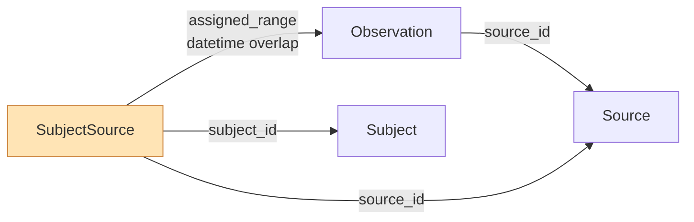
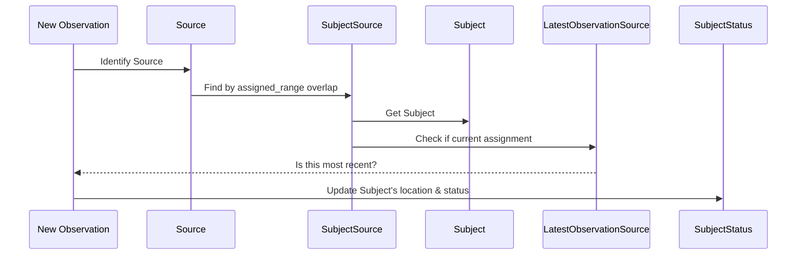

# EarthRanger Architecture Diagram

```mermaid
graph TB
    subgraph "Client Layer"
        UI[Web UI/Mobile Apps]
    end

    subgraph "Application Layer"
        Django[Django + DRF]
        WebSocket[WebSocket Server]
    end

    subgraph "Background Processing"
        Celery[Celery Workers]
        CeleryBeat[Celery Beat<br/>Scheduler]
    end

    subgraph "Message Queue"
        Redis[Redis<br/>Cache & Queues]
        Kombu[Kombu<br/>PubSub]
    end

    subgraph "Database Layer"
        PgCat[PgCat<br/>Load Balancer]
        Primary[(Primary DB<br/>PostgreSQL/PostGIS)]
        Replicas[(Read Replicas<br/>AlloyDB/Cloud SQL)]
    end

    subgraph "Core Data Models"
        subgraph "Activity Domain"
            Events[Events<br/>EventType V1/V2]
            Patrols[Patrols<br/>Patrol Segments]
            Collections[Collections<br/>Incidents]
        end

        subgraph "Observations Domain"
            Observations[Observations<br/>2.5B+ records<br/>Partitioned by month]
            SourceProvider[SourceProvider<br/>Device Providers]
            Source[Source<br/>GPS/IoT Devices]
            Subject[Subject<br/>Animals/Vehicles/People]
            SubjectSource[SubjectSource<br/>Assignment with<br/>assigned_range]
            SubjectStatus[SubjectStatus<br/>Latest Position Cache<br/>Delay Permissions]
            LatestObsSource[LatestObservationSource<br/>Quick Lookup Cache]
        end

        subgraph "Grouping"
            SubjectGroup[SubjectGroup<br/>Hierarchical]
            SourceGroup[SourceGroup<br/>Hierarchical]
        end
    end

    subgraph "External Systems"
        GPS[GPS/Telemetry<br/>Providers]
        Maps[Mapping Services]
    end

    %% Client connections
    UI --> Django
    UI --> WebSocket

    %% Application layer connections
    Django --> Redis
    Django --> PgCat
    Django --> Celery
    WebSocket --> Redis
    WebSocket --> Kombu

    %% Background processing
    Celery --> Redis
    Celery --> PgCat
    CeleryBeat --> Celery

    %% Database connections
    PgCat --> Primary
    PgCat --> Replicas

    %% Data model relationships
    Django --> Events
    Django --> Patrols
    Django --> Observations
    Django --> Subject

    Events -.-> Subject
    Events -.-> Patrols
    Events --> Collections

    Observations --> Source
    Source --> SourceProvider
    SubjectSource --> Source
    SubjectSource --> Subject
    Subject --> SubjectStatus
    Subject --> SubjectGroup
    Source --> SourceGroup

    %% Real-time update flow
    Observations -.->|triggers update| SubjectStatus
    SubjectSource -.->|assigned_range<br/>determines relationship| Observations
    LatestObsSource -.->|optimization| SubjectStatus

    %% External integrations
    GPS --> Django
    Django --> Maps

    %% Nightly maintenance
    CeleryBeat -.->|nightly job| SubjectStatus

    %% Styling
    classDef primary fill:#4A90E2,stroke:#2E5C8A,color:#fff
    classDef cache fill:#E27D4A,stroke:#8A4A2E,color:#fff
    classDef data fill:#50C878,stroke:#2E7D4A,color:#fff
    classDef external fill:#9B59B6,stroke:#6C3483,color:#fff

    class Django,WebSocket primary
    class Redis,Kombu,LatestObsSource,SubjectStatus cache
    class Primary,Replicas,Observations data
    class GPS,Maps external
```

## Key Relationships

### Observation to Subject Relationship (Indirect)

### Real-Time Subject Status Update Flow

## System Scale
- **800+ tenants** (multi-tenant system)
- **2.5 billion** observation records
- **32,000 users**
- **4 million** new observations per day
- **Partitioned tables** by month for performance

## Key Design Patterns
1. **Indirect relationships**: Observations don't directly reference Subjects; relationship inferred through Source → SubjectSource → Subject with time-based assigned_range
2. **Caching layers**: SubjectStatus and LatestObservationSource provide quick lookups
3. **Time-based assignments**: SubjectSource.assigned_range determines which observations belong to which subject
4. **Partitioning**: Large tables (Observations) partitioned by month for performance
5. **Revision tracking**: Selected tables store full change history
6. **JSON flexibility**: EventType schemas and additional fields use JSON for flexible data structures
