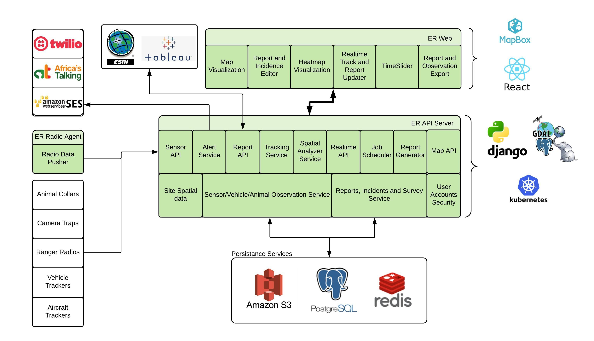

# EarthRanger Architecture

## The EarthRanger software architect
Is described in python-developer-rules.mdc

## Technology
The django web framework along with Django rest framework is our main tool.
We use postgresql either in Google Cloud SQL or AlloyDB. PgCat provides load balancing to our Read Replicas.
Redis is used for caching and celery job queues. Kombu for pubsub messaging.

## Data Size
* 800 tenants and growing
* 2.5 billion sensor data points (observation)
* 32,000 users
*
## Revisions
For some tables, we store all changes made by the user by using a matching revisions table for the originating table.

## Activity - events and patrols
the Django Activity app contains our events and patrols implementation
### Events
Events capture location, event time, who recorded the information, and structured data based on the event type.
An Event Type is used to describe specific data to be collected using json schema to specify the data capture format. A schema is defined in the "json" field, additionally the UI layout is described in the "ui" field.

Events can be associated with subjects. Events can have attachments and notes. An event can be associated with a patrol

A collection is a way to group events of significance together. An Incident is a specific collection type.

#### EventType V1
[EventType V1](eventtype_v1.md)

#### EventType V2

[EventType V2](eventtype_v2.md)

### Patrols
More generally, a patrol is an acitivity. This activity is lead by a patrol leader. It has a start time and place. During a patrol, Events can be collected.

Currently a Patrol has patrol segments, that are meant to be used to capture specific legs of a patrol. The people joining a patrol would be recorded in the patrol segment.

## Observations
### Observation table
this is the big table. Currently at 2.5 billion records, and growing 4 million rows a day. The table has been partitioned by month. We don't currently have plans to archive any data as we promissed a user can review in real-time all of their subject data using our timeslider. And yes, loading a map with 5 years of data would crowd the map.

**Important Schema Note**: The Observation table does NOT have a direct subject_id field. The relationship to subjects is inferred through the following indirect path:
- Observation.source → SubjectSource.source_id
- SubjectSource.subject_id (via the assigned_range datetime overlap)
- The SubjectSource.assigned_range field determines which subject an observation belongs to during a specific time period

### SourceProvider
A Source has an associated SourceProvder
Attributes include
* Display name
* lag notification threshold
* additional: json attributes, letting us store unstructured data per provider

### Source
every Observation record has an associated source. Think of the source as a device, collar, tracker, weather station, etc.
Attributes include
* Manufacturer_id
* Model Name
* Source Provider
* additional: json attributes, letting us store unstructured data per provider

### Subject
This is the animal, vehicle, person carrying the source.
Attributes include
* Subject Type - Wildlife, Vehicle, Person, Stationary Subject
* Subject subtype - Wildlife: elephant, giraffe, etc. Vehicle: car, truck, etc. Person: Ranger, manager, dog_team
* Sex
* additional: json attributes, letting us store unstructured data per provider
* Active - is animal active, shown on map, returned in most api calls

### SubjectSource
A Subject carries a Source for a fixed time. The assignment is kept in the SubjectSource table, which as a date range "assigned_range" which is when the subject had the source. We use this daterange as a filter on the observations table so we only get those source and assigned_range observations when we build the track for a Subject

### SubjectStatus
The SubjectStatus record for a Subject holds the latest movement and status of the radio that subject is assigned.

### SubjectGroup
A hierarhical grouping of Subjects. A Subject can exist in more than one group. Groups can be nested as sub groups

### SourceGroup
A hierachical grouping of Sources. Simialar to subjects, a source can be in more than one group. Groups can be nested as sub groups.

#### Real-time Updates
When a new Observation is added to the database, the following process occurs:

1. Identify the Source of the new Observation
2. Find the Subject that has this Source assigned during the Observation's `recorded_at` time by checking the `SubjectSource.assigned_range`
3. Verify that the identified SubjectSource is the active record for the Subject during that time period
4. Confirm this Observation is the most recent one by:
   - Searching the Observation table for this Source within the assigned_range. We want the most recent in the assigned_range for this Source
   - If the Observation's Source is currently assigned to the subject, we can optimize this search by getting the Observation from the LatestObservationSource table.
5. Update the Subject's SubjectStatus record with the new Observation data

#### Daily Maintenance
A nightly job runs to ensure SubjectStatus records remain accurate. For each Subject:

1. Iterate through the Subject's assigned SubjectSource records, ordered by descending `assigned_range`
2. Find the most recent non-excluded Observation for each Source
3. Update the SubjectStatus record with the most recent valid Observation
   - Typically found within the current SubjectSource assigned_range
   - May require checking previous assigned_range windows if no recent Observation exists
