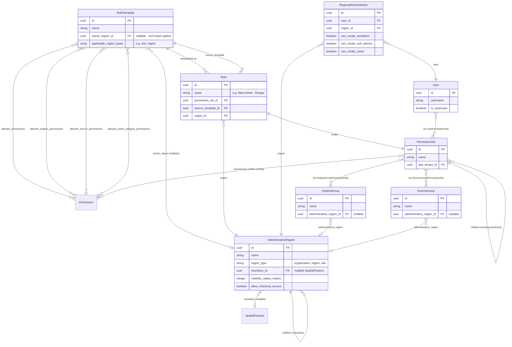
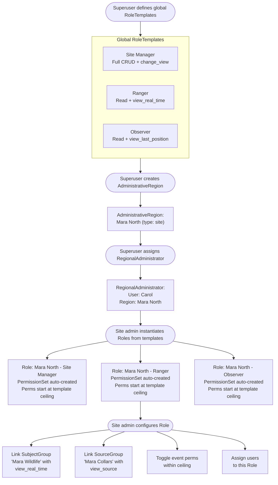
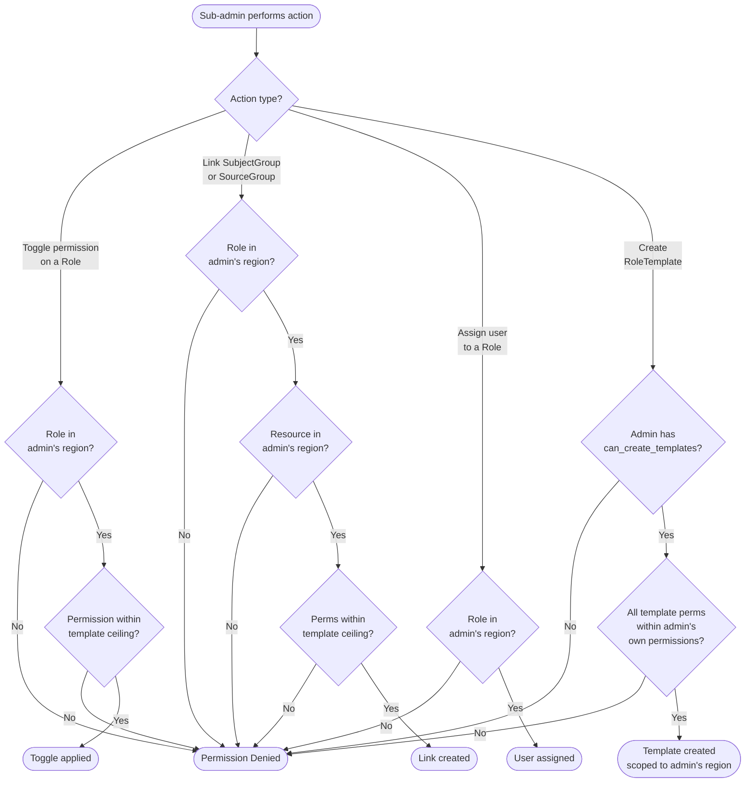
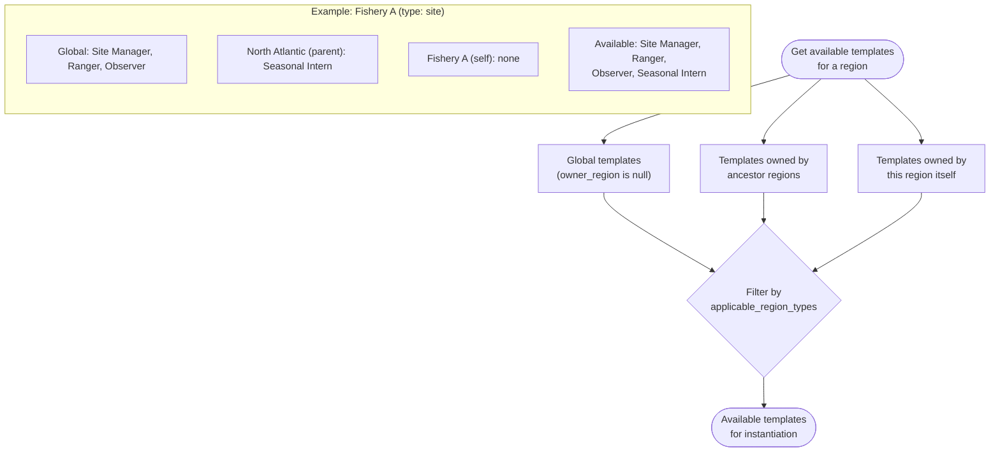

# Hierarchical Permissions

## Summary

This document defines a hierarchical permission system that enables **delegated administration** - allowing organizations to designate sub-admins who can manage permissions for a subset of users within a defined geographic and functional scope.

**Key concepts:**
- **RoleTemplate** - A blueprint defining the maximum permissions a role can include (the "ceiling")
- **Role** - An instance of a RoleTemplate scoped to an AdministrativeRegion, wrapping a PermissionSet
- **AdministrativeRegion** - A hierarchical geographic unit (Organization → Region → Site)
- **RegionalAdministrator** - A user with delegated admin authority over a region

**Design principles:**
- Sub-admins configure Roles within template ceilings (Philosophy B) - they can toggle permissions on/off but cannot exceed the template
- Sub-admins manage Role assignments, not users themselves
- Templates provide governance; Roles provide flexibility
- Existing PermissionSets continue to work unchanged (backward compatible)

---

## Requirements

The following requirements drove this design. While examples reference the fisheries/buoy use case, the architecture is domain-agnostic.

### 1. Regional Administration Authority
Today, EarthRanger assumes a single organization centrally administers all data. For multi-site deployments, we need tiered authority at organization, regional, and site levels. A site admin should be able to administer permissions for their site, but not others.

### 2. Scoped Data Access
When external software accesses EarthRanger, it should operate **on behalf of a specific user**, not with broad application-level permissions. Data access should be restricted to that user's permissions.

### 3. Permissions Based on Geography
Users should see data (subjects, deployments) only within their permitted geographic region.

### 4. Current Data Only
Some users should only see real-time data, not historical tracks.

### 5. Owned Data Always Visible
Users should always see their own deployments regardless of other permission restrictions. Requires identity linkage between EarthRanger and external systems (e.g., gear manufacturers).

### 6. Configurable Visibility Radius
The visibility radius (how close a user must be to see data) should be configurable per-region, not system-wide.

### 7. Audit Trail
Track who changed permissions, what changed, and when - for auditing, legal, and security purposes.

---

### Example: Fisheries/Buoy Use Case

This example maps the abstract model to a concrete fisheries deployment:

| Admin Level | AdministrativeRegion | RegionalAdministrator Capabilities |
|-------------|---------------------|-----------------------------------|
| **System Admin** | (superuser) | Create global RoleTemplates, create top-level regions, full system access |
| **Multi-Region Admin** | Organization (e.g., "Massachusetts") | Create RoleTemplates scoped to their org, create sub-admins, manage all child regions |
| **Site Admin** | Site (e.g., "Cape Cod Fishery") | Instantiate Roles from templates, toggle permissions within ceiling, assign users, link SubjectGroups/SourceGroups |
| **End User** | (none - not an admin) | Uses permissions granted via assigned Roles |

**Example RoleTemplates for fisheries:**

| RoleTemplate | Functional Permissions | Subject Permissions | Notes |
|--------------|----------------------|---------------------|-------|
| Site Manager | Full CRUD on events, change_view | view_real_time, change_alerts | Can configure who sees what |
| Enforcement Officer | Read events, view historical | view_real_time, view_delayed | Filter/search gear, view ownership |
| Fisherman | Read own events | view_real_time, view_last_position | See owned gear + nearby gear |
| Analyst | Read events | view_real_time | View manufacturer gear in region |
| Manufacturer | Read events | view_last_position | See own gear health, no owner info |

## Current Django Permission System Architecture

### Overview
EarthRanger already has a robust hierarchical permission system built on Django's permission framework. The core components are:

#### 1. PermissionSet Model (`das/accounts/models/permissionset.py`)
- Extends `TenantHierarchyModel` providing built-in hierarchy support
- Has a `children` many-to-many relationship for parent-child hierarchies
- Multi-tenant aware via `das_tenant` field
- Links to Django's standard `Permission` model via many-to-many
- Provides `get_ancestors()` and `get_descendants()` methods for hierarchy traversal

#### 2. User-PermissionSet Relationship (`das/accounts/mixins.py`)
- Users belong to PermissionSets via `UserPermissionSet` through table
- Users automatically inherit permissions from their PermissionSets AND all ancestor PermissionSets
- Method `get_all_permission_sets()` walks up the hierarchy to gather all permissions
- Supports multiple PermissionSet membership per user

#### 3. Permission Resolution (`das/accounts/backends.py:194-293`)
- `AccountsModelBackend` handles all permission checking
- Supports object-level permissions via `get_obj_permission_set_ids()` method
- Permissions are calculated as the intersection of:
  - User's PermissionSets (including ancestors)
  - Object's associated PermissionSets (if object-level permissions are implemented)
- Superusers bypass all permission checks
- Multi-tenant filtering automatically applied to all permission queries
#### 4. Subject and Source permissions
- A PermissionSet is assigned to a SubjectGroup or a SourceGroup to grant permissions to Subjects and Sources.
- The PermissionSet permissions are cummulative. Any permission to see all subject location data, grants that user those permissions for all subjects then can view.
#### 5. Event Permissions
- Permissions to view and created events are done through EventCategory.
- Names PermissionSet with EventCategory named permissions grant access

### Mapping to Hierarchical Requirements

| Requirement | Current Support | Status | Implementation Notes |
|------------|----------------|---------|---------------------|
| **Tiered Roles** (System Admin → Multi-region → Region → IC) | PermissionSet hierarchy with `children` relationship | ✅ Supported | Can model role hierarchy using PermissionSet parent-child relationships. No explicit "role template" concept yet. |
| **Regional Administration Authority** | Object-level permissions framework exists | ⚠️ Partial | Framework exists but needs geographic/regional fields added to PermissionSets or models |
| **Scoped Data Access** (software acts on behalf of user) | Object-level permissions via `get_obj_permission_set_ids()` | ✅ Supported | Already implemented - models can restrict access based on user's PermissionSets |
| **Geography-based Permissions** | Removed in migration 0056 | ❌ Not Supported | Previously existed but was deleted. Needs to be rebuilt with shapefile/polygon support |
| **Time-based Restrictions** (current vs historical) | User.mou_expiry_date exists | ⚠️ Partial | Individual user expiry exists, but no general time-based permission filtering |
| **Ownership-based Access** ("see all owned data") | No built-in support | ❌ Not Supported | Would need owner relationships on models and special permission logic |
| **Dynamic Radius Visibility** | System-wide setting removed | ❌ Not Supported | Previously was system-wide; needs per-user or per-region implementation |
| **Traceable History** (audit trail) | Models extend `TimestampedModel` | ⚠️ Partial | Created/modified timestamps exist, but no detailed change tracking for permission modifications |

### Architecture Strengths

1. **Hierarchy Already Works**: The `TenantHierarchyModel` base class provides full hierarchy support with ancestor/descendant traversal
2. **Permission Inheritance**: Users automatically inherit all permissions from parent PermissionSets up the hierarchy
3. **Object-Level Permissions**: Framework supports restricting access to specific objects based on PermissionSet membership
4. **Multi-Tenant Foundation**: All permission components are tenant-aware and properly isolated
5. **Django Integration**: Leverages Django's proven permission framework (auth.Permission model)
6. **Flexible Through Tables**: Many-to-many relationships use explicit through tables for extensibility

### Implementation Gaps

#### 1. Geographic Scoping
**What's Needed:**
- Add geographic/regional fields to PermissionSet (or create a GeoPermissionSet model)
- Store shapefile/polygon data for regional boundaries
- Implement geographic filtering in querysets based on user's region
- Support for multiple geographic regions per PermissionSet

**Implementation Approach:**
- Option A: Add `region` foreign key and `geographic_boundary` (GeometryField) to PermissionSet
- Option B: Create separate `RegionalPermission` model that links PermissionSets to geographic areas
- Must support hierarchy: Federal → Regional → Fishery geographic scopes

#### 2. Role Templates
**What's Needed:**
- Formal "Role" concept (System Admin, Multi-region Admin, Region Admin, IC roles)
- Base permission templates for each role type
- Ability to create PermissionSets from role templates
- Role modification rules (who can modify which roles)

**Implementation Approach:**
- Create `Role` model with predefined role types
- Link PermissionSets to Roles (optional relationship)
- Provide management commands or admin interface to create PermissionSets from role templates
- Store role-specific metadata (e.g., "can_create_users_in_region")

#### 3. Enhanced Permission Types
**What's Needed:**
- **Ownership tracking**: Link deployments/observations to owner users
- **Time-based access**: Permission validity dates, data access windows (current-only vs historical)
- **Dynamic radius**: Per-user or per-region visibility radius (not system-wide)

**Implementation Approach:**
- Add `owner` field to relevant models (Subject, Deployment, etc.)
- Create `PermissionSetConstraint` model with time and radius fields
- Implement custom permission checks that consider ownership, time, and location
- Store per-region radius in PermissionSet.additional JSON field or separate model

#### 4. Audit Trail for Permission Changes
**What's Needed:**
- Track who modified PermissionSets and when
- Track permission grant/revoke events
- Track user-to-PermissionSet membership changes
- Queryable audit log for compliance and security

**Implementation Approach:**
- Integrate django-auditlog or implement custom change tracking
- Log all changes to PermissionSet, UserPermissionSet, PermissionSetPermission
- Store actor (who made change), timestamp, before/after values
- Provide admin interface to view audit logs

#### 5. Scoped User Administration
**What's Needed:**
- Region Admins can only create/manage users within their region
- Multi-region Admins can create users across their regions
- Prevent privilege escalation (admins can't create users with higher privileges)

**Implementation Approach:**
- Check admin's PermissionSet hierarchy when creating/modifying users
- New user's PermissionSets must be descendants of admin's PermissionSets
- Validate geographic scope matches admin's region(s)
- Add custom permission checks in User ViewSet/Admin

---

## Design Decisions

### Vocabulary

| Concept | Name | Description |
|---------|------|-------------|
| Permission ceiling blueprint | **RoleTemplate** | Defines the maximum permissions a role can include. Templates are the governance layer. |
| Concrete role at a site | **Role** | Instance of a RoleTemplate, scoped to an AdministrativeRegion. Wraps a PermissionSet. |
| Bag of permissions (existing) | **PermissionSet** | Internal plumbing. Unchanged. Role wraps it with governance metadata. |
| Geographic admin unit | **AdministrativeRegion** | Hierarchy: Organization → Region → Site |
| Delegated admin | **RegionalAdministrator** | User with admin authority over a region |

**Why "Role" and not just "PermissionSet"?**
PermissionSet is an implementation concept (a bag of permissions). Users and admins think in terms of Roles: "Jane is a Ranger," "Bob is a Regional Manager." Role is introduced as a new model that wraps a PermissionSet with governance metadata (template linkage, region scoping). Existing PermissionSets without Roles continue to work unchanged.

### Data Model

**Entity Relationship Diagram:**



### Flows and Enforcement

**RoleTemplate Ceiling Concept:**

```mermaid
graph TB
    subgraph "RoleTemplate: Ranger"
        direction TB
        T_func["Functional Ceiling<br/>monitoring_read<br/>security_read"]
        T_subj["Subject Ceiling<br/>view_real_time<br/>view_last_position"]
        T_src["Source Ceiling<br/>view_source"]
        T_evt["Event Category Ceiling<br/>monitoring_read<br/>security_read"]
    end

    subgraph "Role: Mara North - Ranger"
        direction TB
        R_func["Functional Perms<br/>monitoring_read &#9679;<br/>security_read &#9675; OFF"]
        R_subj["Subject Perms<br/>'Mara Wildlife' linked<br/>view_real_time &#9679;"]
        R_src["Source Perms<br/>'Mara Collars' linked<br/>view_source &#9679;"]
        R_evt["Event Category Perms<br/>monitoring_read &#9679;<br/>security_read &#9675; OFF"]
    end

    T_func -->|"ceiling"| R_func
    T_subj -->|"ceiling"| R_subj
    T_src -->|"ceiling"| R_src
    T_evt -->|"ceiling"| R_evt

    R_func --- note1["Sub-admin toggled<br/>security_read OFF"]
    R_evt --- note2["Sub-admin toggled<br/>security_read OFF"]
```



**Region Creation and Role Instantiation Flow:**



**Sub-Admin Enforcement Flow:**



**Template Availability Resolution:**



**Example Scenarios:**

```mermaid
graph TB
    subgraph "Scenario 1: Superuser"
        S1User["User: Alice<br/>is_superuser: true"]
        S1User --> S1Result["Can manage ALL Roles,<br/>RoleTemplates, and Regions.<br/>Creates global RoleTemplates.<br/>Creates top-level Regions."]
    end

    subgraph "Scenario 2: Regional Admin"
        S2User["User: Bob<br/>RegionalAdministrator<br/>region: North Atlantic<br/>can_create_templates: true<br/>can_create_sub_admins: true"]
        S2User --> S2Can["Can manage Roles in:<br/>North Atlantic + all child sites<br/>Can create RoleTemplates<br/>scoped to North Atlantic<br/>Can assign site-level admins"]
        S2Can --> S2Result["Examples:<br/>Can configure 'Fishery A - Ranger' Role<br/>Can configure 'Fishery B - Ranger' Role<br/>Can create 'Seasonal Intern' template<br/>Cannot touch South Atlantic Roles"]
    end

    subgraph "Scenario 3: Site Admin"
        S3User["User: Carol<br/>RegionalAdministrator<br/>region: Fishery A<br/>can_create_templates: false<br/>can_create_sub_admins: false"]
        S3Can["Can manage Roles in:<br/>Fishery A only<br/>Can instantiate Roles from<br/>available templates<br/>Can toggle perms within ceiling<br/>Can assign users to Roles"]
        S3User --> S3Can
        S3Can --> S3Result["Examples:<br/>Can toggle security_read OFF<br/>on 'Fishery A - Ranger'<br/>Can link 'FA Deployments' SubjectGroup<br/>Can assign Jane to Ranger Role<br/>Cannot create templates<br/>Cannot touch Fishery B"]
    end

    subgraph "Scenario 4: End User (No Admin)"
        S4User["User: Dan<br/>No RegionalAdministrator record"]
        S4User --> S4Result["Cannot manage any Roles.<br/>Only uses permissions granted<br/>via their assigned Roles."]
    end
```



### Core Architecture: Templates as Permission Ceilings

Sub-admins operate under **Philosophy B**: they can configure permissions within their region's Roles, but are bounded by the RoleTemplate ceiling. They cannot create templates — they must request new templates from a higher-level admin.

#### RoleTemplate

A RoleTemplate defines the **maximum permissions** available for a role type. It is the single source of truth for what a Role can contain across all four permission dimensions:

1. **Functional permissions** (actions: `monitoring_create`, `change_view`, etc.)
2. **Subject permissions** (which subject-level perms: `view_real_time`, `view_last_position`, etc.)
3. **Source permissions** (which source-level perms: `view_source`, `view_source_details`, etc.)
4. **Event category permissions** (which category perms: `security_create`, `monitoring_read`, etc.)

```python
class RoleTemplate(TenantModelMixin, TimestampedModel):
    id = models.UUIDField(primary_key=True, default=uuid.uuid4)
    name = models.CharField(max_length=255)  # "Ranger", "Site Manager", "Observer"

    # Functional permission ceiling
    allowed_permissions = models.ManyToManyField(
        'auth.Permission',
        related_name='role_templates_as_permission',
        blank=True,
    )

    # Subject permission ceiling
    allowed_subject_permissions = models.ManyToManyField(
        'auth.Permission',
        related_name='role_templates_as_subject_perm',
        limit_choices_to={'content_type__model': 'subject'},
        blank=True,
    )

    # Source permission ceiling
    allowed_source_permissions = models.ManyToManyField(
        'auth.Permission',
        related_name='role_templates_as_source_perm',
        limit_choices_to={'content_type__model': 'source'},
        blank=True,
    )

    # Event category permission ceiling
    allowed_event_category_permissions = models.ManyToManyField(
        'auth.Permission',
        related_name='role_templates_as_event_perm',
        limit_choices_to={'content_type__model': 'eventcategory'},
        blank=True,
    )

    # Governance: who owns this template?
    # null = global (superuser/federal created, available everywhere)
    # set  = only available within this region and its children
    owner_region = models.ForeignKey(
        'AdministrativeRegion',
        null=True, blank=True,
        on_delete=models.CASCADE,
    )

    # Which region types can use this template?
    applicable_region_types = ArrayField(
        models.CharField(max_length=50),
        default=list,  # e.g. ['site'], ['region', 'site'], etc.
    )
```

#### Template Governance

- **Superusers/Federal admins** create global templates (available everywhere)
- **Regional admins** can create templates scoped to their region (available to child regions)
- **Site admins** cannot create templates — they request from their regional admin
- A regional admin creating a template **cannot include permissions they don't have themselves** (prevents escalation)

Available templates for any region are resolved as:
```python
def get_available_templates(region):
    """Global templates + templates owned by any ancestor region"""
    ancestor_ids = region.get_ancestors(include_self=True).values_list('id', flat=True)
    return RoleTemplate.objects.filter(
        Q(owner_region__isnull=True) |           # Global templates
        Q(owner_region_id__in=ancestor_ids)       # Templates from ancestor regions
    ).filter(
        applicable_region_types__contains=[region.region_type]
    )
```

#### Template Evolution

When a superuser updates a template (adds a new permission):
- The ceiling is **auto-expanded**: the permission becomes available for sub-admins to enable
- It is **not auto-granted**: existing Roles don't get it until a sub-admin explicitly enables it
- When a permission is **removed** from a template, it is auto-removed from all Roles derived from that template

### Role Model

Role is the user-facing concept. It wraps a PermissionSet with governance metadata.

```python
class Role(TenantModelMixin, TimestampedModel):
    """User-facing role. Wraps a PermissionSet with template and region governance."""
    id = models.UUIDField(primary_key=True, default=uuid.uuid4)
    name = models.CharField(max_length=255)        # "Mara North - Ranger"
    permission_set = models.OneToOneField(PermissionSet, on_delete=models.CASCADE)
    source_template = models.ForeignKey(RoleTemplate, on_delete=models.PROTECT)
    region = models.ForeignKey(AdministrativeRegion, on_delete=models.CASCADE)
```

Existing PermissionSets without a Role wrapper continue to work unchanged. New delegated-admin features require Roles.

### AdministrativeRegion

Uses the existing `TenantHierarchyModel` for hierarchy support.

```python
class AdministrativeRegion(TenantHierarchyModel, TimestampedModel):
    id = models.UUIDField(primary_key=True, default=uuid.uuid4)
    name = models.CharField(max_length=255)
    region_type = models.CharField(max_length=50)  # Free-form, tenant-configured
    boundary = models.ForeignKey(
        'mapping.SpatialFeature', null=True, blank=True, on_delete=models.SET_NULL
    )
    # Region-specific settings
    visibility_radius_meters = models.PositiveIntegerField(default=50000)
    allow_historical_access = models.BooleanField(default=True)
```

Domain-agnostic region type vocabulary:

| Level | Generic Term | Fisheries Example | Wildlife Example |
|-------|-------------|-------------------|------------------|
| Top | Organization | Federal authority | National parks authority |
| Middle | Region | State/coastal region | Regional conservancy |
| Bottom | Site | Individual fishery | Individual park/reserve |

### RegionalAdministrator

```python
class RegionalAdministrator(TenantModelMixin, TimestampedModel):
    user = models.ForeignKey(User, on_delete=models.CASCADE)
    region = models.ForeignKey(AdministrativeRegion, on_delete=models.CASCADE)

    can_create_templates = models.BooleanField(default=False)
    can_create_sub_admins = models.BooleanField(default=False)
    can_create_users = models.BooleanField(default=False)

    class Meta:
        unique_together = ['das_tenant', 'user', 'region']
```

Regional admins inherit authority over child regions. A Region-level admin automatically has administrative authority over all Sites within that region.

### Delegation Scope: What Sub-Admins Can Do

Sub-admins manage **the relationship between users and Roles**, not the users themselves. This avoids the "who owns the user" problem.

A sub-admin can:
- **Assign/unassign users** to/from Roles within their region
- **Toggle permissions** within a Role, bounded by the RoleTemplate ceiling
- **Link SubjectGroups** to Roles (SubjectGroup must be in their region)
- **Link SourceGroups** to Roles (SourceGroup must be in their region)
- **Toggle EventCategory permissions** within a Role, bounded by template ceiling
- **Cannot** modify Roles outside their region
- **Cannot** create RoleTemplates (unless `can_create_templates=True`, typically regional+)
- **Cannot** grant permissions not in the template

### Region Creation Flow

```
1. Superuser creates RoleTemplates:
     "Site Manager"  → [monitoring_*, security_*, change_view]
     "Ranger"        → [monitoring_read, security_read, view_real_time]
     "Observer"      → [monitoring_read, view_last_position]

2. Superuser creates AdministrativeRegion "Mara North" (type='site')

3. Site admin instantiates Roles from available templates:
     Role: "Mara North - Site Manager"
       source_template = "Site Manager"
       region = Mara North
       permission_set → (auto-created, starts with all template permissions)

     Role: "Mara North - Ranger"
       source_template = "Ranger"
       region = Mara North
       permission_set → (auto-created, starts with all template permissions)

4. Site admin links SubjectGroups in their region:
     SubjectGroupPermissionSet: "Mara North Wildlife" → "Mara North - Ranger" permission_set
       subject perms: [view_real_time] (within template ceiling)

5. Site admin links SourceGroups in their region:
     SourceGroupPermissionSet: "Mara North Collars" → "Mara North - Ranger" permission_set
       source perms: [view_source] (within template ceiling)

6. Site admin assigns users:
     UserPermissionSet: Jane → "Mara North - Ranger" permission_set
```

### Enforcement Pattern

One consistent pattern across all resource types:

```python
class RegionalAdminService:
    def __init__(self, admin_user, region):
        self.admin_user = admin_user
        self.region = region
        self.managed_regions = region.get_descendants(include_self=True)
        self.managed_roles = Role.objects.filter(region__in=self.managed_regions)

    def _check_role_in_scope(self, role):
        if role not in self.managed_roles:
            raise PermissionDenied("Role not in your administrative scope")

    def _check_resource_in_region(self, resource):
        if resource.administrative_region not in self.managed_regions:
            raise PermissionDenied("Resource not in your region")

    def _check_template_ceiling(self, role, permission, ceiling_field):
        ceiling = getattr(role.source_template, ceiling_field)
        if permission not in ceiling.all():
            raise PermissionDenied("Not allowed by template")

    def toggle_permission(self, role, permission, enable):
        self._check_role_in_scope(role)
        self._check_template_ceiling(role, permission, 'allowed_permissions')
        if enable:
            role.permission_set.permissions.add(permission)
        else:
            role.permission_set.permissions.remove(permission)

    def link_subject_group(self, role, subject_group, perms):
        self._check_role_in_scope(role)
        self._check_resource_in_region(subject_group)
        for p in perms:
            self._check_template_ceiling(role, p, 'allowed_subject_permissions')
        SubjectGroupPermissionSet.objects.create(
            subjectgroup=subject_group,
            permissionset=role.permission_set,
        )

    def link_source_group(self, role, source_group, perms):
        self._check_role_in_scope(role)
        self._check_resource_in_region(source_group)
        for p in perms:
            self._check_template_ceiling(role, p, 'allowed_source_permissions')
        SourceGroupPermissionSet.objects.create(
            sourcegroup=source_group,
            permissionset=role.permission_set,
        )

    def toggle_event_permission(self, role, permission, enable):
        self._check_role_in_scope(role)
        self._check_template_ceiling(role, permission, 'allowed_event_category_permissions')
        if enable:
            role.permission_set.permissions.add(permission)
        else:
            role.permission_set.permissions.remove(permission)

    def assign_user(self, user, role):
        self._check_role_in_scope(role)
        UserPermissionSet.objects.create(
            user=user,
            permissionset=role.permission_set,
        )
```

### Backward Compatibility

- Existing PermissionSets continue to work as-is. No migration needed.
- Existing admin/superuser workflows are unchanged.
- RoleTemplate/Role/AdministrativeRegion are opt-in: a tenant uses them when they need delegated administration.
- Sites that don't need hierarchical admin ignore these models entirely.

### Remaining Requirements (Not Yet Designed)

These requirements from the original spec are related but need separate design work:

| # | Requirement | Notes |
|---|-------------|-------|
| 2 | Scoped API access (on behalf of user) | OAuth-style delegation for external software |
| 4 | Current data only (no history) | Leverage existing `access_begins_*`/`access_ends_*` permissions |
| 5 | Always see owned deployments | Override permission filtering for `Subject.owner` |
| 6 | Per-geography visibility radius | `AdministrativeRegion.visibility_radius_meters` provides the hook |
| 7 | Audit trail | Track who changed permissions, when, before/after values |

## Resources
[Discovery findings for Buoy Permissions and Roles](https://docs.google.com/presentation/d/1wWdVIxZMthLuUvxlfa_mVz1SsAl6kqXkwZaq_5EvJik/edit?usp=sharing)

[Permissions and Roles](https://docs.google.com/presentation/d/1Ayb2uN8K95XQp4f6OOa4xXdb4ECdLdg9LWZS1NpKBxI/edit?usp=sharing)

[NFWF - Permissions Matrix](https://docs.google.com/spreadsheets/d/1AQjQDJItIIO6iV2v1HiLWLWfcN2kd_jA/edit?usp=sharing&ouid=115831598831099106015&rtpof=true&sd=true)

[ER Buoy - Roles and Permissions (confluence)](https://allenai.atlassian.net/wiki/x/CIAEFAc)

[Epic RF-8 Permissions based on Geography](https://allenai.atlassian.net/browse/RF-8)
