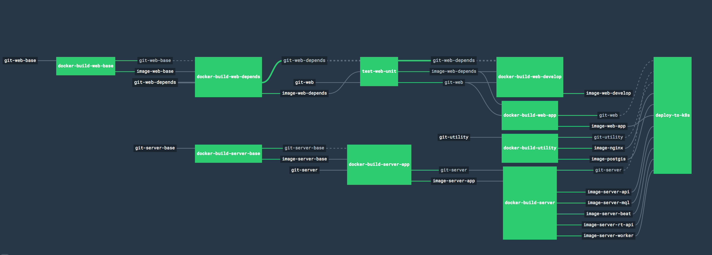

## Dockerized Deployment

This page and its descendants capture the knowledge transfer result from shared services to  regarding configuring and deploying das via the shared services build and deployment tools

For each project, the shared services team provides a baseline set of tools for building and deploying\. These tools are:

+ A Concourse instance to build the project

+ A Docker container registry to host the build output for the project

+ A Kuberbetes cluster with an appropriate number of machines for the project's requirements

+ Shared Services can create additional Kubernetes clusters, if necessary

Once these tools have been set up and handed off, further deployment configuration is the responsibility of the project team\. This configuration includes:

+ Configuring the Concourse build pipeline(s) via a per\-pipeline yaml file

+ Pushing Docker containers to the registry

+ Configuring Kubernetes to correctly deploy the Docker containers to the cluster

For details regarding configuring and using the build tools, see the following links:


### Setup ###
The tools and scripts for managing pipelines require access to a bash shell. Preferred to use ubuntu, but some have had success with other platforms.

#### fly ####
[fly](https://concourse.ci/fly-cli.html) is the command line tool to control concourse
Look for the script install.fly.cli.sh found in the infrastucture repo 
run it:

    ./docker/utility/fly/install/install.fly.cli.sh


#### Shared Services Documentation ####
The Shared Services team is now documenting their work here [Infrastcture Docs](https://github.com/VulcanTechnologies/infrastructure/wiki)

The primary tool for managing concourse pipelines is found in the infrastructure docker image. The infrastructure docker image logs in using your Vulcan helium credentials and also will prompt to get a token from GCP. Your username is case sensitive.

''''
cd /das
./manage.padas-app.sh
''''


### Configuring Concourse

Concourse lives here: [https://35.197.37.215](https://35\.197\.37\.215)
Concourse for VDP is here: [https://35.199.175.103](https://35.199.175.103)

Concourse pipelines are configured by creating a set of resources, jobs, and gates\. A resource is a _thing_  like a file (local or hosted somewhere else), a git repository, or a docker container\. A job is an _action_  that takes one or more resources as input, performs an operation on them, and usually outputs a new resource\. Some examples of jobs are cloning or pulling a git repo, compiling code, running unit tests, and executing a script\. A gate is a _condition_  that must happen before a job is performed\. Most often this is "Did the unit tests pass?" or "Did the build/script/whatever complete successfully?"


A pipeline in Concourse is a series of resources, jobs, and gates that perform actions in sequence\. For DAS, it looks like this (resources are the strings with gray backgrounds, jobs are the green boxes):



The top pipeline incrementally gathers the code for and builds the web app, and the bottom pipeline incrementally gathers and builds the middleware\. The final steps gather the web app and middleware resources, combine them, and push them out to a kubernetes (k8s) cluster on Google's cloud\.

##### Resources

Concourse builds are configured in \.yaml files stored in the das/das\-web git repositories\.  [Here is the current Concourse config for the dev middleware pipeline](https://github\.com/PADAS/das/blob/develop/ci/das\.pipeline\.yaml)^[https://github\.com/PADAS/das/blob/develop/ci/das\.pipeline\.yaml]\. For reasons discussed [later](#PAGE_44557325), the build is more granular and incremental than a typical Jenkins build\. For example, the middleware code is divided into two resources\. The first one:

**DAS Server Base**


~~~~~~~
resources:
- name: git-server-base
  type: versioned-git-resource
  source:
    uri: git@github.com:PADAS/das.git
    branch: ((server-branch-name))
    paths: 
      - dependencies/* 
      - docker/base/*
    private_key: ((server-private-key))
~~~~~~~

This resource declaration defines a resource named git\-server\-base\. The content of this resource is a branch of the das server git repo, but only the dependencies and docker/base folders\. The rest of the code does not belong to this resource\. Note that branch name and the key used to auth with git are specified elsewhere

**Das Server**


~~~~~~~
- name: git-server
  type: versioned-git-resource
  source:
    uri: git@github.com:PADAS/das.git
    branch: ((server-branch-name))
    private_key: ((server-private-key))
~~~~~~~

This resource is almost the same, but it is not restricted to only two directories\. It grabs the entire DAS server codebase\. 

##### Jobs

**Das Server Base Job**


~~~~~~~
jobs:  
- name: docker-build-server-base
  plan:
  - get: git-server-base
    trigger: true
  - put: image-server-base
    params: {
      build: git-server-base,
      dockerfile: git-server-base/docker/base/Dockerfile,
      tag:  git-server-base/sha,
      tag_as_latest: true
    }
    get_params: {skip_download: true}
~~~~~~~

A job has two parts, a get and a put\. Get specifies which resources will be used in the job\. These must be defined in the resources section; you can't give a filename or url\. The get in this job will watch git\-server\-base and trigger the job whenever there is a change\. Technically, when there is a change it will check its triggers to see if it should start the job or not, but this trigger is just "true" so it will always start the job when it detects a change\.

When this job triggers, it will create a docker image with the base server code (only das/dependencies and das/docker/base) according to the specified parameters\. In this case, it uses the code in git\-server\-base and a dockerfile to create a docker image, tags it, and makes the image available as a resource named image\-server\-base, which other jobs can then use as input\.

The last line (\{skip\_download: true\}) is not necessary, but is a helpful optimization\. Typically, jobs will re\-download all resources to make sure they have the latest versions\. Imagine a pipeline that runs on multiple machines; some resources might get stale\. We do not have Concourse configured that way though, so we can be sure our resources are never stale\. This line prevents unnecessary downloads and saves quite a bit of time\.


**Das Server job**


~~~~~~~
- name: docker-build-server-app
  plan:
  - aggregate:
    - get: git-server-base
      passed: [docker-build-server-base]
    - get: image-server-base
      passed: [docker-build-server-base]
      trigger: true
      params: {
        skip_download: true
      }
    - get: git-server
      trigger: true
  - put: image-server-app
    params: {
      build: git-server,
      dockerfile: git-server/docker/App/Dockerfile,
      tag:  git-server/sha,
      build_args_file: git-server-base/build_args,
      tag_as_latest: true
    }
    get_params: {skip_download: true}

~~~~~~~

Here is a slightly more complicated job\. Note that it consumes multiple resources; it combines the image created in the earlier job, and adds in the DAS codebase from git\. IT accomplishes this by putting all required resources in an aggregate block\.

It also includes triggers to ensure this job only runs if the jobs that create its input resources completed successfully\. You can check the latest status of a concourse job just by specifying the job's name, so that's all that's needed here\. All triggers and passed items must resolve to true for the job to happen\. Any failures will prevent the job from kicking off\.

Once the concouse pipeline configuration is complete, push it up to concourse with the command:

~~~~~~

./set.pipeline.sh [pipeline_name]

~~~~~~

To delete an existing concourse pipeline, use the following command:
~~~~~~

fly -t padas-app destroy-pipeline -p [pipeline_name]
~~~~~~

To pass variables into the configuration, see the section [_Passing arguments into pipelines_](#Passing-arguments-into-pipelines)

### Configuring Docker

DAS's build process consists of creating a minimal docker containers for each component (web app, middleware, database, redis), and then building the containers up incrementally in a way that optimizes the way docker handles changes in containers\.

##### DAS Server Base #####

The minimal container for the DAS middleware is a standard ubuntu machine with the das dependencies installed\. It is defined in [this dockerfile](https://github\.com/PADAS/das/blob/develop/docker/base/Dockerfile)^[https://github\.com/PADAS/das/blob/develop/docker/base/Dockerfile]:

**Das Server Base Dockerfile**


~~~~~~~
FROM ubuntu:16.04
MAINTAINER Chris Doehring, chrisdo@vulcan.com & Matt Korwel, mattko@vulcan.com  

RUN apt-get update \
    && apt-get install -y \
    git \
    libpq-dev \
    python3-pip \
    && apt-get autoremove \
    && apt-get clean

VOLUME /workspace
WORKDIR /workspace

ADD ./dependencies /workspace/dependencies
RUN dpkg -i /workspace/dependencies/proj_4.9.3-1_amd64.deb
RUN dpkg -i /workspace/dependencies/gdal_2.2.2-1_amd64.deb
RUN dpkg -i /workspace/dependencies/geos_3.6.2-1_amd64.deb
ENV LD_LIBRARY_PATH "/usr/local/lib"

RUN pip3 install -U "pip"
RUN pip3 install -r /workspace/dependencies/requirements.txt -r /workspace/dependencies/requirements-pinned.txt --no-cache-dir -f /workspace/dependencies/wheelhouse

RUN mkdir -p /var/www/app && mkdir -p /startup
ADD ./docker/base/start.sh /var/www/app/start.sh
ADD ./docker/base/wait_for.sh /startup/wait_for.sh

ENTRYPOINT ["/var/www/app/start.sh"]
~~~~~~~

Line 1 specifies the base image, which is the current LTS release at the time of this writing\.

Lines 4\-10 Install basics like git and python

Lines 16\-18 Install "the tough ones" like gdal, which must be installed via their installers instead of through automated tools like apt or pip

Line 22 uses pip to install the python libraries DAS uses

Lines 25 and 26 add scripts that we need to be available inside the container

Instead of continuing on, the image is finalized here (and concourse publishes this intermediate image to our container store) The reasoning here is that these dependencies change infrequently, and take a relatively long time to download and install\. If the script continued and pulled the DAS code, set up a server, and started serving, dependencies would be re\-downloaded and re\-installed with every code change\. By breaking out the image with the dependencies separate from the code itself, the intermediate dependency\-only image an be re\-used easily when code changes without having to be re\-created\.

##### DAS Server App

**Das Server App Dockerfile**


~~~~~~~
ARG base_tag=latest
FROM gcr.io/padas-app/base:${base_tag}

ADD ./das /var/www/app

VOLUME /tmp
WORKDIR /var/www/app

ENV DJANGO_SETTINGS_MODULE=das_server.local_settings_docker
~~~~~~~

This dockerfile extends the base server image\. This is specified on Line 2, with the expectation that the base image is stored in our container store on Google's cloud\.

Line 4 adds the DAS server code to the docker image\. This dockerfile is expected to be used in a context where the das code exists at \./das (Concourse's das\-server\-build\-app job pulls the das code as a resource and places it in \./das, then runs this dockerfile) 

Once the code is added to the image, the settings file is specified, and then a second intermediate image is created and published

##### DAS Server API #####

**Das Server App Dockerfile**


~~~~~~~
ARG base_tag=latest
FROM gcr.io/padas-app/app:${base_tag}
ADD ./start.sh /var/www/app/start.sh
EXPOSE 8000
~~~~~~~

The final docker container simply takes the das\-server\-app image created earlier and starts the server\. The end result is a container that, when started, runs das\-server automatically\.

It may seem trivial to make a whole separate step just to start the server\. The reason it is broken out this way is so that, if there are no code changes, re\-deploying the server is as fast as possible\. If this were included in the DAS Server App container, redeploying would involve re\-pulling the latest das code and copying it into the machine\. This is unnecessary if there are no code changes; re\-pulling would get the same code that already exists in the app image\. This way that step can be skipped and the server an be started independently\.

### Configuring Kubernetes

##### Infrastructure Scripts #####

The code repo for all of the configuration and helper scripts is located [here](https://github\.com/VulcanTechnologies/infrastructure)^[https://github\.com/VulcanTechnologies/infrastructure]. clone it locally for easy access.

This also assumes you have docker installed ([instructions here](https://vulcan\.atlassian\.net/wiki/display/IUU/OnBoarding)^[https://vulcan\.atlassian\.net/wiki/display/IUU/OnBoarding]) and you have a bash shell available.

These scripts will be referenced below\. The scripts managing K8s clusters use a docker version of gcloud sdk to execute the actual commands\. Those K8s management scripts mount the current directory in the gcloud container under /code. 

##### Creating a new Pipeline #####

```
infrastructure/resources/k8s/create.gcp.cluster padas-app <clustername>
```

at which point configuration files are created for the \<clustername\> in deployments/padas\-app/k8s

open
```
deployments/padas-app/k8s/<clustername>.docker.versions
```
using a text editor
Add the SHAs for the docker images you want used for the pipeline.


<put an example here>

Once entered, deploy and restart cluster. CD to the das/deployments directory that contains the yaml configurations for all of the servers. Then execute the following:
```
deploy.to.cluster padas-app <clustername> ./ <clustername>.docker.versions
```


To list the running apps

```
kubectl get pods
```

##### Web view of Pipeline #####

The command to view the current

##### Passing arguments into pipelines

SS's infrastructure will create a docker container based on the configuration files you generate as described in this document. Sometimes however, you will not be able to or want to specify certain pieces of information in your configuration. For example, you might have sensitive information like a password you'd like to provide when creating the container, but not leave the password in the config file on github.

Let's walk through a scenario where we'd like to supply a password for an SMTP email service. This password should be provided when the contaner is created, but never in a file that will be on github. When the container is created, the password should be stored in an environment variable called EMAIL-PASSWORD

In this case, we want the API container to cointain the environment variable, so let's edit deployment/api-deployment.yaml

~~~~~~

apiVersion: apps/v1beta1
kind: Deployment
metadata:
  name: api
spec:
  template:
    metadata:
      labels:
        das.component: api
    spec:
      imagePullSecrets:
        - name: gcr-secret
      containers:
      - image: gcr.io/padas-app/api:${GIT_SERVER_SHA}
        name: das-api
        ports:
          - containerPort: 8000
        env:
        - name: DB_HOST
          valueFrom:
            configMapKeyRef:
              name: default-configmap
              key: DB_HOST
        - name: DB_PORT
          valueFrom:
            configMapKeyRef:
              name: default-configmap
              key: DB_PORT
        - name: EMAIL_PASSWORD
          valueFrom:
            configMapKeyRef:
              name: default-configmap
              key: EMAIL_PASSWORD

~~~~~~

You can see the list of environment variables that will be created includes DB_HOST, DB_PORT, and EMAIL_PASSWORD. Obviously, EMAIL_PASSWORD is the important bit here. This specifies that the variable's value will come from the config map. So let's look at that next...

ci/demo.params.yaml is an example of a parameters file:

~~~~~~

project-id: padas-app
cluster-name: demo
server-branch-name: demo
web-branch-name: develop

~~~~~~

It contains a simple set of key-value pairs that correspond to the variables used in the concourse pipeline and container container specification. Note that it doesn't contain email password! This is generally where we'd put things that change from pipeline to pipeline, but this file will get checked into github, so we can't put the password in here. Instead, we will just specify it on the command line when creating the pipeline

~~~~~~

./set.pipeline.sh demo -v email-password=h@rdT0gu3S5

~~~~~~

Here we're telling set.pipeline to use the demo params, and passing in an extra parameter not specified in the params file: the email password

#### Deployment Controller
The Shared Services team has created a docker based image that contains the deployment controller commands called the Vulcan Platform Tools Image read about it (here)[https://github.com/VulcanTechnologies/infrastructure/wiki/Vulcan-Platform-Tools-Image] which includes any troubleshooting steps.
We launch this container from the root of the das project using the shell script 'manage.padas-app.sh'

Once launched the container mounts the das directory under workdir. From there we can start running commands through shell scripts to create, update and delete pipelines.

#### To get the Concourse password for your pipeline
From the VPT container run the following. The login id is vulcan
```
./tools-scripts/ci/get.concourse.password.sh
```

#### Add SSL certificate as a Secret in Vault
`````
/vulcan-platform-tools/tools-scripts/secrets/vault/write.secret.from.file.sh padas-app bundle-crt bundle.crt
/vulcan-platform-tools/tools-scripts/secrets/vault/write.secret.from.file.sh padas-app pamdas-org-private-key-pem pamdas.org-private-key.pem 
`````
verify the data was written:
~~~
vault read padas-app/main/bundle-crt
~~~


Next we update task: update-deployment-info in both deployment.pipeline.yaml and integration.pipeline.yaml to get our secrets to K8s
    add:
    ~~~
    BUNDLE_CRT: ((bundle-crt))
    PAMDAS_ORG_PRIVATE_KEY_PEM: ((pamdas-org-private-key-pem))
    ~~~
    
Now add that env variable in default-configmap.yaml

~~~
  BUNDLE_CRT: ${BUNDLE_CRT}
  PAMDAS_ORG_PRIVATE_KEY_PEM: ${PAMDAS_ORG_PRIVATE_KEY_PEM}
~~~

Reference these in the nginx-deployment.yaml so the env variables are set to be found by start.sh. Under the key 'env'
~~~
        - name: BUNDLE_CRT
          valueFrom:
            configMapKeyRef:
              name: default-configmap
              key: BUNDLE_CRT
        - name: PAMDAS_ORG_PRIVATE_KEY_PEM  
          valueFrom:
            configMapKeyRef:
              name: default-configmap
              key: PAMDAS_ORG_PRIVATE_KEY_PEM
~~~

Then in nginx/start.sh

~~~
SSL_PATH=/etc/ssl

if [ -v $BUNDLE_CRT ]; then
    echo $BUNDLE_CRT > $SSL_PATH/bundle.crt
    echo $PAMDAS_ORG_PRIVATE_KEY_PEM > $SSL_PATH/pamdas.org-private-key.pem
fi
~~~

Finally

push the code to the repo, then update the build pipeline

~~~
git push origin develop
 ./tools-scripts/ci/set.integration.pipeline.sh integration
~~~


#### Create a Build and Deploy Pipeline
We will be using the command ./tools-scripts/k8s/create.gcp.cluster.sh described (here)[https://github.com/VulcanTechnologies/infrastructure/wiki/Kuberntes-Infrastructure-Management#destroy-a-cluster]. Look there also for commands to update and destroy a cluster.
Build and Deploy is known as an Integration pipeline.

``````
cd das
./manage.padas-app.sh
./tools-scripts/k8s/create.gcp.cluster.sh
``````


#### Deploy a new Pipeline
We will be using the command 'set.deployment.pipeline.sh' to create a deployment. We can also include secrets or other parameters to the pipeline in this command.


``````
cd das
./manage.padas-app.sh
./tools-scripts/ci/set.deployment.pipeline.sh {your-pipeline-name} -v {param-name}={param-value}

for example:
./tools-scripts/ci/set.deployment.pipeline.sh seattle -v email-password=kdjfsijiejfkjsldkjfis

``````
To diagnose or run commands against this new pipeline, we need to set the context to that pipeline by this command:
```
./tools-scripts/k8s/manage.existing.cluster.sh padas-app seattle
```

If we need to copy in data to load into a pipeline using django management commands, first we copy in from the workdir for example here we are going to load .json files that describe a data model found in a datamodel folder:
```
kubectl cp workdir/datamodel api-3695077833-q9klq:/tmp
```
One copied into the running container:

```
kubectl exec -it api-3695077833-q9klq -- bash
cd /
```


to delete this pipeline, run the following command.
```
fly -t padas-app destroy-pipeline -p {your-pipeline-name}
```

### Developing in a Dockerized Environment FAQ

#### To get a management web view of the current cluster configuration
Parameters for view.k8s.cluster.proxy are:
* Project
* Cluster Name
* Port (default is 8001)
~~~
../infrastructure/resources/k8s/view.k8s.cluster.proxy.sh padas-app integration 8003
~~~

#### To remote into a pod running on an existing cluster
Use the script manage.existing.cluster.sh. This also mounts the current directory in the docker container as /code
* Project
* Cluster Name
````
../infrastructure/resources/k8s/manage.existing.cluster.sh padas-app integration
````

#### To delete an existing cluster
Use the script delete.gcp.cluster.sh
```
../infrastructure/resources/k8s/delete.gcp.cluster.sh padas-app integration
```

__How do I remote into an image running on a GCP kubernetes cluster?__

First, you'll want to get the gcloud command line tools\.


~~~~~~~
hickeys: ~/git/das $ docker run -it google/cloud-sdk
~~~~~~~

now you're running in a docker container with the gcloud command line tools already installed\. You need to log in to your gcp account:


~~~~~~~
root@69c7d34860a5:/# gcloud auth login
~~~~~~~

This will give you a link to open in your favorite web browser which will prompt you for your login info, and then give you an auth code to paste back into your command line\. Next you need to set some environment variables. Note the 3rd command is picking the integration pipeline, replace this with whatever pipeline you want to see


~~~~~~~
root@69c7d34860a5:/# gcloud config set project padas-app
root@69c7d34860a5:/# gcloud config set compute/zone us-west1-a
root@69c7d34860a5:/# gcloud container clusters get-credentials integration
~~~~~~~

Now your environment is configured and ready to start doing stuff\. Take a look at all the kubernetes pods like this:


~~~~~~~
``root@69c7d34860a5:/# kubectl get pods``

NAME                      READY     STATUS    RESTARTS   AGE
api-4041812951-2dmmx      1/1       Running   0          18h
beat-1939016954-mrrxv     1/1       Running   0          18h
mql-1451428868-ch3q8      1/1       Running   0          18h
nginx-2615626993-frxtz    1/1       Running   0          2d
postgis-0                 1/1       Running   0          5d
redis-472649242-rk447     1/1       Running   0          5d
rt-api-869413010-cl8d6    1/1       Running   0          18h
web-415869906-2d9hr       1/1       Running   0          23h
worker-1000738804-mc9s1   1/1       Running   0          18h
~~~~~~~

What you see here are all the apps running on kubernetes\. Find the app you're interested in and grab the name\. Then you can just open an interactive terminal in the image just like docker, but using kubectl


~~~~~~~
root@69c7d34860a5:/# kubectl exec -it api-4041812951-2dmmx -- bash
~~~~~~~

Now you have a bash terminal in the API server\. Have fun\!

__How do I restore a database dump to a pipeline running on kubernetes?__

Restoring a pg_dump to a postgres machine running on google's kubernetes system is a complicted process. There are a few hurdles to get through:
1. Connecting to the postgres database
2. Copying the dump file to a place where you can restore it
3. Clearing out database locks so you can do the restore
4. Bringing the system back up

So let's get started!

___Connect to the postgres database___
The simplest way is to connect to the actual machine running postgres using the method above (How do I remote into an image running on a GCP kubernetes cluster?) However, in the final step, insted of picking the api machine and remoting into it, choose the postgres instance. Unlike the API, this will always have the same ID, so you can skip the `kubectl get pods` commmand and just use `postgis-0`

___Copy the dump file to a place you can restore it___

Now that you're on the postgres box, we will copy the dump file to it. We're going to use the google cloud command line tool to grab a dump that we've previously uploaded to a storage bucket.

1. We'll need to install a few tools first. Curl to download the gcloud app, and python2.7 because gcloud requires it
sudo sed -i -e 's/us.archive.ubuntu.com/archive.ubuntu.com/g' /etc/apt/sources.list
~~~~~
sudo apt-get update
sudo apt-get install curl
sudo apt-get install python2.7
~~~~~

2. Now we can download and install gcloud. The first command will run the installer, the second restarts the shell to pick up the changes to the environment
~~~~~
curl https://sdk.cloud.google.com | bash
exec -l $SHELL
~~~~~

3. Now we can download the dump from cloud storage to the machine. This example assumes there's a file called liwonde_dump in the padas-tmp storage bucket, update with your buckey/dump file
~~~~~
gsutil cp gs://padas-tmp/liwonde_dump ./liwonde_dump
~~~~~

___Release locks on the database___

Other kubernetes pods are running components that lock the database. We'll need to kill them so they release their locks, but if we don't do it right, kubernetes will "help" and bring them back up. Here's how to kill them dead for sure.

1. Shared services has a script that manages docker configuration, so start off by running that. SS scripts are in the infrastructure repository; they are _not_ in the das repo. Note that you should do this from your local machine, not from the postgres box that you're remoted into (but you should keep the connection, so do this in a new window)
~~~~~
infrastructure/resources/k8s/view.k8s.cluster.proxy.sh padas-app liwonde-post-migration
~~~~~

2. Now go to your browser of choice and visit `http://localhost:8001/ui` From here, you can manage the pipeline's kubernetes cluster. From the ... menu on the right of each deployment, delete 'api', 'mql', 'rt_api', and 'worker'. Then delete these again from the Pods section at the bottom of the page.

3. Those apps will take a little time to shut down, but now you can go back to the kubernetes postgres machine and continue the restore.

4. Do the actual database restore

___Bring the system back up___

Now the data is all sorted out, all that's left to do is re-create the pods we deleted. Go to concourse (concourse.pamdas.org) and navigate to the pipeline you're modifying. Select the last step (deploy_to_k8s) and use the + button at the top right to rebuild it. This will recreate all the stuff you deleted earlier. Note that you don't need to do a complete rebuild, you only need to re-deploy the previous build output.


